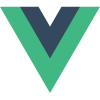
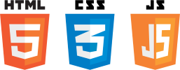
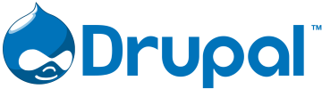

# CODECADEMY

## Description
These projects are part of the Codecademy Pro program. They are designed to present skills gained in programming lessons.

## Author's Current Studies
Currently, I am working on Codecademy's Full-Stack Web Developer certification.

## Author's Goals
My overall goal is to become a freelance Web Developer, so I can create websites for several companies.

### Current Experience
  